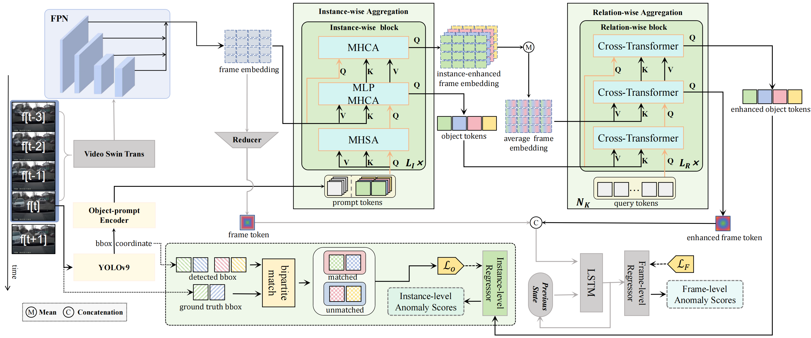

# PromptTAD: Object-Prompt Enhanced Traffic Anomaly Detection(RA-L 2025)

We propose **PromptTAD**, a brand new architecture for both frame-level and instance-level video anomaly detection. The code is developed based on the Pytorch framework.

[](https://paperswithcode.com/sota/online-video-anomaly-detection-on-detection?p=memory-augmented-online-video-anomaly)

<!--  -->

https://private-user-images.githubusercontent.com/116262238/436016532-ace99e60-a889-4c35-ba45-10d925f68a0e.mp4


## Introduction

Ego-centric Traffic Anomaly Detection (TAD) aims to identify abnormal events in videos captured by dashboard-mounted cameras in vehicles. Compared to anomaly detection in roadside surveillance videos, ego-centric TAD poses greater challenges due to the dynamic backgrounds caused by vehicle motion. Previous frame-level methods are often vulnerable to interference from these dynamic backgrounds and struggle to detect small objects located at a distance or off-center. To address these challenges, we propose an object-prompt enhanced method that integrates detected traffic objects into a frame-level TAD framework. Our approach introduces an object-prompt scheme comprising an object prompt encoder, along with two cross-attention-based aggregation modules: an instance-wise aggregation module for fusing information between object instances and the scene, and a relation-wise aggregation module for capturing relationships inter-objects. Additionally, we design an instance-level loss to supervise anomaly detection at the object level. Our method effectively mitigates interference from dynamic backgrounds, improves the detection of distant or off-center anomalies, and enables precise spatial localization of anomalies. Experimental results on the DoTA and DADA-2000 datasets demonstrate that our method achieves state-of-the-art performance.

## Requirements
### 1. Conda env preparation
```bash
git clone https://github.com/Smartpearkorl/PromptTAD.git
cd PromptTAD
conda create -n pama python=3.11.9 
conda activate poma
pip install -r requirements.txt
```
### 2. Pathes determination
File ***PromptTAD/runner/__init__.py*** determines the shared parameters, such as the <a id="DataPath"></a>path of the dataset, the path of the font, etc.

```python
'''
1. define some shared parameters
'''
from pathlib import Path
# dataset folder
DATA_FOLDER = Path('/data/qh/DoTA/data')
DoTA_FOLDER = Path('/data/qh/DoTA/data') 
DADA_FOLDER = Path('/data/qh/DADA2000/')
META_FOLDER = DATA_FOLDER / 'metadata'
# pretrained model folder
pretrained_weight_path = Path('/data/qh/pretrain_models/')
vst_pretrained_weight_path = pretrained_weight_path / 'swin_base_patch244_window1677_sthv2.pth'
yolov9_c_convertd_weight_path = pretrained_weight_path / 'yolov9-c-converted.pt'
# font path for plotting figures
FONT_FOLDER = "/data/qh/dependency/arial.ttf"
CHFONT_FOLDER = "/data/qh/dependency/microsoft_yahei.ttf"
# debug folder: mostly applied in /PromptTAD/runner/src/custom_tools.py, where there are some debugging tools
DEBUG_FOLDER = Path("/data/qh/DoTA/output/debug/")
```

### 3. Download pretrained weights and other files
The checkpoints and inference results for PromptTAD, as well as the bounding boxes for yolov9, can be downloaded from <a id="GoogleDrive"></a>[here](https://drive.google.com/drive/folders/1ClJZj7a-aYrAaaOAH9C1yQ4zvx7vEtzC?usp=sharing). And Video-Swin Transformer pretrained weights can be downloaded from [here](https://github.com/SwinTransformer/storage/releases/download/v1.0.4/swin_base_patch244_window1677_sthv2.pth).


### 4. Prepare DoTA and DADA dataset
Datasets can be downloaded from [DoTA](https://github.com/MoonBlvd/Detection-of-Traffic-Anomaly) and [DATA](https://github.com/JWFangit/LOTVS-DADA), and should be stored in the [`DoTA_FOLDER`](#DataPath) directory. You should obtain the following structure:
```
DoTA_FOLDER                             DADA_FOLDER  
├── annotations                        ├── DADA_dataset  
│   ├── 0qfbmt4G8Rw_000306.json        │   └── 1  
│   ├── 0qfbmt4G8Rw_000435.json        │       ├── 001  
│   ├── 0qfbmt4G8Rw_000602.json        │           ├── attach  
│   ...                                │               ├── 001_anomaly.txt  
├── frames                             │               ├── 001_coordinate.txt  
│   ├── 0qfbmt4G8Rw_000072             │           ├── fixation  
│   ├── 0qfbmt4G8Rw_000306             │           ├── images  
│   ├── 0qfbmt4G8Rw_000435             │           ├── maps  
│   ...                                │       ├── ...  
└── metadata                           │   └── 2  
    ├── metadata_train.json            │       ├── ...  
    ├── metadata_val.json              │   └── ...  
    ├── train_split.txt                ├── videos  
    └── val_split.txt                  │   ├── images_1_001.avi  
                                       │   ├── images_1_002.avi  
                                       │   ...  
                                       ├── test_file.json  
                                       ├── train_file.json  
                                       └── val_file.json  
```

Convert videos to images on DADA dataset using the following command:
```bash
python runner/src/dada_prepare.py
```

To unify the format in DoTA and DADA, [the downloaded dataset files](https://drive.google.com/drive/folders/1ClJZj7a-aYrAaaOAH9C1yQ4zvx7vEtzC?usp=sharing) need to be extracted to their respective locations to achieve the following structure:
```
DoTA_FOLDER                             DADA_FOLDER  
├── annotations                         ├── annotations  
│   ├── 0qfbmt4G8Rw_000306.json         │   ├── 1_001.json  
│   ├── 0qfbmt4G8Rw_000435.json         │   ├── 1_002.json  
│   ├── 0qfbmt4G8Rw_000602.json         │   ├── 1_003.json  
│   ...                                 │   ...  
├── frames                              ├── frames  
│   ├── 0qfbmt4G8Rw_000072              │   ├── 1_001  
│   ├── 0qfbmt4G8Rw_000306              │   ├── 1_002  
│   ├── 0qfbmt4G8Rw_000435              │   ├── 1_003  
│   ...                                 │   ...  
├── yolov9                              ├── yolov9  
│   ├── 0qfbmt4G8Rw_000072.json         │   ├── 1_001.json  
│   ├── 0qfbmt4G8Rw_000306.json         │   ├── 1_002.json  
│   ├── 0qfbmt4G8Rw_000435.json         │   ├── 1_003.json  
│   ...                                 │   ...  
└── metadata                            └── metadata  
    ├── noego_metadata_test.json.json       ├── minibox_metadata_val.json  
    ├── ego_metadata_test.json              ├── metadata_train.json  
    ├── metadata_test.json                  ├── metadata_val.json  
    ├── test_file.json                      ├── minibox_val_split.txt  
    ├── train_file.json                     ├── train_split.txt  
    └── val_file.json                       └── val_split.txt  
```

<!-- ```
DoTA_FOLDER
├── annotations
│   ├── 0qfbmt4G8Rw_000306.json
│   ├── 0qfbmt4G8Rw_000435.json
│   ├── 0qfbmt4G8Rw_000602.json
│   ...
├── frames
│   ├── 0qfbmt4G8Rw_000072
│   ├── 0qfbmt4G8Rw_000306
│   ├── 0qfbmt4G8Rw_000435
│   .... 
├── yolov9
│   ├── 0qfbmt4G8Rw_000072.json
│   ├── 0qfbmt4G8Rw_000306.json
│   ├── 0qfbmt4G8Rw_000435.json
│   .... 
└── metadata
    ├── noego_metadata_test.json.json
    ├── ego_metadata_test.json
    ├── metadata_test.json
    ├── test_file.json  
    ├── train_file.json  
    └── val_file.json  
```

```
DADA_FOLDER
├── annotations
│   ├── 1_001.json
│   ├── 1_002.json
│   ├── 1_003.json
│   ...
├── frames
│   ├── 1_001
│   ├── 1_002
│   ├── 1_003
│   .... 
├── yolov9
│   ├── 1_001.json
│   ├── 1_002.json
│   ├── 1_003.json
│   .... 
└── metadata
    ├── minibox_metadata_val.json 
    ├── metadata_train.json
    ├── metadata_val.json
    ├── minibox_val_split.txt
    ├── train_split.txt
    └── val_split.txt

DoTA_FOLDER
├── annotations
│   ├── 0qfbmt4G8Rw_000306.json
│   ├── 0qfbmt4G8Rw_000435.json
│   ├── 0qfbmt4G8Rw_000602.json
│   ...
├── frames
│   ├── 0qfbmt4G8Rw_000072
│   ├── 0qfbmt4G8Rw_000306
│   ├── 0qfbmt4G8Rw_000435
│   .... 
└── metadata
    ├── metadata_train.json
    ├── metadata_val.json
    ├── train_split.txt
    └── val_split.txt
```

```
DADA_FOLDER
├── DADA_dataset
│     └── 1
│         │── 001
│            │── attach
│                │── 001_anomaly.txt
│                │── 001_coordinate.txt
│            │── fixation
│            │── images
│            │── maps
│        │── ...
│     └──2
│        │── ...
│     └── ...
├── videos
│   ├── images_1_001.avi
│   ├── images_1_002.avi
│   .... 
│── test_file.json
│── train_file.json
└── val_file.json
``` -->

## Usage

### Checkpoints 
[The Checkpoints file](https://drive.google.com/drive/folders/1ClJZj7a-aYrAaaOAH9C1yQ4zvx7vEtzC?usp=sharing) contains the pretrained models and results for the DoTA and DADA datasets. The folder ***vst,ins,fpn(1),prompt(1),rnn,vcl=8*** includes the full model trained and evaluated on the DoTA dataset, while the folder ***Test On DADA*** contains the evaluation results for the DADA dataset.
```
Checkpoints
├── vst,ins,fpn(1),prompt(1),rnn,vcl=8  
│   ├── evaluation
│   │   ├── eval.txt 
│   │   └── stauc_eval.txt
│   ├── checkpoints
│   │   └── model-120.pt
│   └── eval
│       └── results-120.pkl
└── Test On DADA
    ├── evaluation
    │   └── model-120.pt
    └── eval
        └── results-120.pkl
```

### Train
```bash
# single GPU
CUDA_VISIBLE_DEVICES=0 python runner/main.py --fp16  --config "configs/train/poma/vst/instance_detection/vst,ins,fpn(1),prompt(1),rnn,vcl=8.py" --output "outputs/vst,ins,fpn(1),prompt(1),rnn,vcl=8/" --phase train --epoch -1
# DDP
CUDA_VISIBLE_DEVICES=0,1 python -m torch.distributed.launch --nproc_per_node=2  runner/main.py --distributed --fp16  --config "configs/train/poma/vst/instance_detection/vst,ins,fpn(1),prompt(1),rnn,vcl=8.py" --output "outputs/vst,ins,fpn(1),prompt(1),rnn,vcl=8/" --phase train --epoch -1

```

### Eval
```bash
# single GPU
CUDA_VISIBLE_DEVICES=0 python runner/main.py --fp16  --config "configs/train/poma/vst/instance_detection/vst,ins,fpn(1),prompt(1),rnn,vcl=8.py" --output "outputs/vst,ins,fpn(1),prompt(1),rnn,vcl=8/" --phase test --epoch 120
# DDP
CUDA_VISIBLE_DEVICES=0,1 python -m torch.distributed.launch --nproc_per_node=2  runner/main.py --distributed --fp16  --config "configs/train/poma/vst/instance_detection/vst,ins,fpn(1),prompt(1),rnn,vcl=8.py" --output "outputs/vst,ins,fpn(1),prompt(1),rnn,vcl=8/" --phase test --epoch 120
```

### STAUC Metrics
```bash
python runner/src/stauc.py --model_folder "outputs/vst,ins,fpn(1),prompt(1),rnn,vcl=8/" --specific_epoch 120 --popr
```

## Results

### Components ablation studies on DoTA dataset
| FPN | Prompt | Ins. Loss | AUC_Test | AUC_Subset | \#Param. | FLOPs   | Conf |  
|:---:|:------:|:---------:|:--------:|:----------:|:--------:|:-------:|:----:|  
| ✗   | ✗      | ✗         | 81.62    | 75.80      | 93.01M   | 398.67G | [conf](configs/train/poma/vst/base_detection/vst,base,dim=1024,fpn(0),prompt(0),rnn,vcl=8.py) |  
| ✓   | ✗      | ✗         | 82.22    | 75.97      | 94.06M   | 405.28G | [conf](configs/train/poma/vst/base_detection/vst,base,fpn(1),prompt(0),rnn,vcl=8.py) |  
| ✗   | ✓      | ✗         | 82.69    | 76.50      | 105.14M  | 401.03G | [conf](configs/train/poma/vst/base_detection/vst,base,fpn(0),prompt(1),rnn,vcl=8.py) |  
| ✓   | ✓      | ✗         | 83.04    | 77.04      | 106.19M  | 439.29G | [conf](configs/train/poma/vst/base_detection/vst,base,fpn(1),prompt(1),rnn,vcl=8.py) |  
| ✗   | ✓      | ✓         | 83.20    | 78.12      | 105.20M  | 401.03G | [conf](configs/train/poma/vst/instance_detection/vst,ins,fpn(0),prompt(1),rnn,vcl=8.py) |  
| ✓   | ✓      | ✓         | **83.87** | **78.77** | 106.25M  | 439.30G | [conf](configs/train/poma/vst/instance_detection/vst,ins,fpn(1),prompt(1),rnn,vcl=8.py) |  


### Relation-wise Aggregation module ablation studies on DoTA dataset
| Configuration              | Relation Variant | Test Set | Subset | Conf |  
|:--------------------------:|:----------------:|:--------:|:------:|:----:|  
| FPN + Prompt               | Reducer          | 82.85    | 76.55  | [conf](configs/train/poma/vst/ablation/vst,base,fpn(1),prompt(no_RA),rnn,vcl=8.py) |  
| FPN + Prompt               | RA Module        | **83.04**| **77.04** | [conf](configs/train/poma/vst/base_detection/vst,base,fpn(1),prompt(1),rnn,vcl=8.py) |  
| FPN + Prompt + Ins. Loss   | Reducer          | 83.32    | 77.80  | [conf](configs/train/poma/vst/ablation/vst,ins,fpn(1),prompt(no_RA),rnn,vcl=8.py) |  
| FPN + Prompt + Ins. Loss   | RA Module        | **83.87**| **78.77** | [conf](configs/train/poma/vst/instance_detection/vst,ins,fpn(1),prompt(1),rnn,vcl=8.py) |  

## License

This repo is released under the  Apache License.

## Acknowledgement
We would like to express our gratitude to the authors of [movad](https://github.com/linyq2117/CLIP-ES), [detr](https://github.com/facebookresearch/detr), [yolov9](https://github.com/WongKinYiu/yolov9), [Segment-Anything](https://github.com/facebookresearch/segment-anything.git), and [DoTA](https://github.com/MoonBlvd/Detection-of-Traffic-Anomaly) for their outstanding contributions and inspiring works.

Pay the highest attribute to [AlchemyCat](https://github.com/HAL-42/AlchemyCat), a powerful and user-friendly deep learning toolkit.

## Citation
If you find our work useful in your research, please cite: 
```
```
